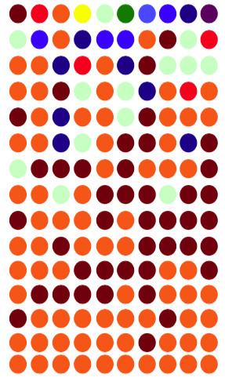
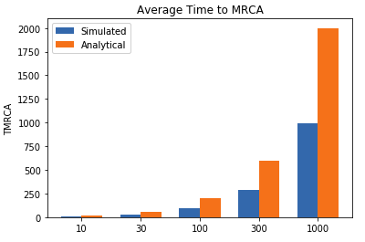
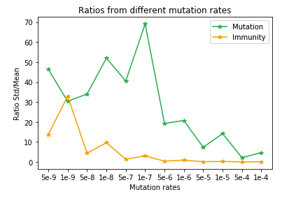

PopulationDynamics [](https://www.paypal.com/cgi-bin/webscr?cmd=_s-xclick&hosted_button_id=EFQXNQ7UYXYKW&source=url)
=======

[PopulationDynamics](https://github.com/thierrygrimm/PopulationDynamics) is a collection of simulations on the dynamics of genetic drift, populations and mutations therein.

## Organization
### Parts
This project consists of three main parts
* [Genetic Drift](https://github.com/thierrygrimm/PopulationDynamics/blob/master/Jupyter%20Notebooks/Genetic%20Drift.ipynb)
* [Finite populations and mutations](https://github.com/thierrygrimm/PopulationDynamics/blob/master/Jupyter%20Notebooks/Finite%20populations%20and%20mutations.ipynb)
* [Acquired immunity and mutation immunity in the population](https://github.com/thierrygrimm/PopulationDynamics/blob/master/Jupyter%20Notebooks/Mutations%20in%20the%20population.ipynb)

## Sections
### Genetic Drift
There is a population of individuals that reproduce without mutation. Each individual has an equal chance to give rise to an individual in the new generation. The new generation is generated synchronously maintaining the same size as the population of the old generation. As a result, some parents will end up having multiple offsprings, while some parents will give rise to no offsprings. 

<p align="center">
  
</p>

The simulation reveals that the population over time always converges to a single allele. Furthermore the time until the most recent common ancestor ```TMRCA``` was calculated and plotted.

<p align="center">
  
</p>


### Finite populations and mutations
Next was a simulation for the evolution of a population of fixed size, each individual having equal probability of reproduction, but also allowing for mutations. These fixated in a number of given alleles.

The code calculates the ```mean number of differences``` between two random individuals in the final population.

<p align="center">
  
</p>

### Mutations in the population
Finally was a simulation of bacterial resistance according to the mathematical modeling of Luria and Delbruck which showed  that the distribution of bacteria resistant to viruses in different cultures can not be explained by an acquired immunity upon virus transfection, but is a consequence of random mutations occurring during the bacterial proliferation. Both the “mutation hypothesis” and an “acquired immunity hypothesis” outlined in the paper were simulated thereim.

The code calculates the ```std/mean``` for different mutation rates for both hypotheses.

<p align="center">
  
</p>


## Issues

Found a bug? Want more features? Find something missing in the documentation? Let us know! Please don't hesitate to [file an issue](https://github.com/thierrygrimm/PopulationDynamics/issues/new) and make a recommendation.

## License
```
PopulationDynamics - A collection of computational-biological population dynamics simulations.

The MIT License (MIT)

Copyright (c) 2019 Thierry Grimm

Permission is hereby granted, free of charge, to any person obtaining a copy
of this software ("PopulationDynamics") and associated documentation files (the "Software"), to deal
in the Software without restriction, including without limitation the rights
to use, copy, modify, merge, publish, distribute, sublicense, and/or sell
copies of the Software, and to permit persons to whom the Software is
furnished to do so, subject to the following conditions:

The above copyright notice and this permission notice shall be included in
all copies or substantial portions of the Software.

THE SOFTWARE IS PROVIDED "AS IS", WITHOUT WARRANTY OF ANY KIND, EXPRESS OR
IMPLIED, INCLUDING BUT NOT LIMITED TO THE WARRANTIES OF MERCHANTABILITY,
FITNESS FOR A PARTICULAR PURPOSE AND NONINFRINGEMENT. IN NO EVENT SHALL THE
AUTHORS OR COPYRIGHT HOLDERS BE LIABLE FOR ANY CLAIM, DAMAGES OR OTHER
LIABILITY, WHETHER IN AN ACTION OF CONTRACT, TORT OR OTHERWISE, ARISING FROM,
OUT OF OR IN CONNECTION WITH THE SOFTWARE OR THE USE OR OTHER DEALINGS IN
THE SOFTWARE.
```
